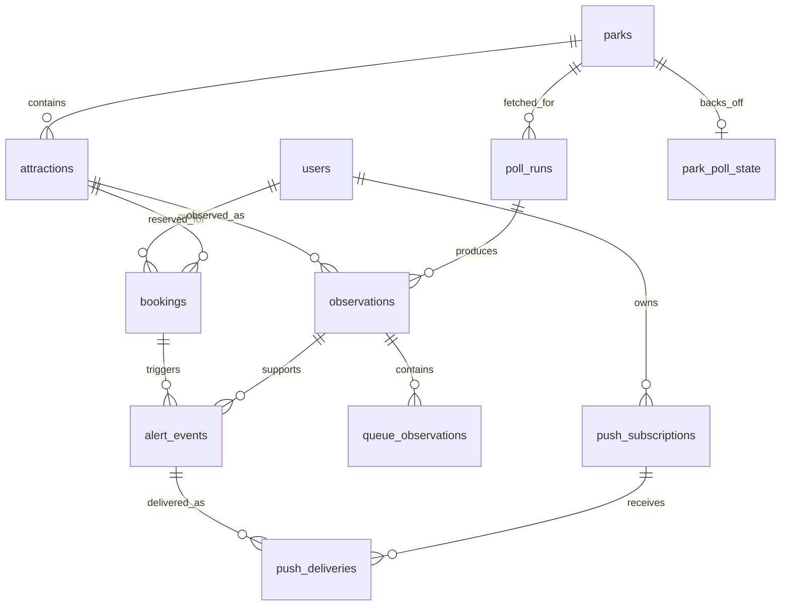

# Architecture

## Runtime and repository

One GitHub monorepo: git@github.com:sdkraemer/dlr_lightning_lane.git.
Next.js App Router serves the mobile PWA and same-origin APIs. A separate Node 24
worker polls ThemeParks.wiki, evaluates targets and sends Web Push. SQLite is shared
through a local volume; Caddy terminates HTTPS. No Redis or separate API service.

Dependencies are locked in package-lock.json. TypeScript is checked with tsc and
Next.js builds; the worker uses Node 24's direct TypeScript execution.

## Implemented flow

1. Authenticate with Auth0 Universal Login, or explicitly use a loopback-only
   development mock session.
2. Add a known attraction, today's reserved return window, and optionally an
   inclusive earliest/latest acceptable return START range.
3. When an eligible watch exists, the worker polls both parks every 60–120 seconds
   (120 default, measured after completion). All attraction/queue observations are
   retained, not only watched rides.
4. Evaluate AVAILABLE RETURN_TIME windows on OPERATING rides using observations
   fetched within five minutes. Windows must parse, not be expired, and start on
   today's Pacific date. An available window whose start has just passed can still
   qualify while its end is in the future.
5. A start inside the target range creates a reached event; outside but within
   the configured margin (15 minutes default, either side) creates approaching.
6. Persist deduplicated events and per-device delivery jobs. The sender rechecks
   booking revision, eligibility and the latest offer before each attempt.
7. The user modifies the booking in Disneyland and updates the reserved window
   here. A reserved start inside the range suppresses future watches/alerts.

Only today's visit date in America/Los_Angeles is eligible. Yesterday and tomorrow
are excluded regardless of stored state. Reserved end may roll past midnight;
the visit date and start remain today. There is no expires_at cutoff.

Watching continues after an offered target is reached; the app cannot infer that
a Disney reservation changed. Each phase is notified once per booking revision.
Edits or explicit resume increment the revision and rearm alerts. Pause/completion
cancel pending deliveries. Reached supersedes an unsent approaching event. Requests
already in flight cannot be recalled. Canceled opportunities do not automatically
rearm the same revision.

The dashboard displays current/last offered times, standby, status, feed freshness,
worker heartbeat and recent push delivery state. It reads SQLite every 15 seconds;
it never polls ThemeParks.wiki from the browser. Past bookings remain in history.

## Polling and persistence

The worker uses a non-overlapping loop, 20-second request timeout, independent
per-park errors and persistent exponential backoff up to 15 minutes. Retry-After
can extend that delay. The ordinary probe obeys watch gating; an explicit one-time
--diagnostic mode can bootstrap the catalog without a booking. It still respects
an existing park backoff.

SQLite enables WAL, foreign keys and a five-second busy timeout. Network calls
run outside transactions. Short write transactions serialize poll persistence
and event creation. Run ONE worker; there is no distributed lease or multi-worker
claim protocol. Deployments must stop the old worker before starting its successor.

Keep fetch time separate from upstream lastUpdated: unchanged source timestamps
do not by themselves mean failed fetches. Null wait is unknown, not zero.
Missing queue keys and present/null payloads remain distinguishable. RETURN_TIME
and PAID_RETURN_TIME are never merged. Raw payloads preserve price and future keys.

Polling only during active watches intentionally leaves historical gaps. No
automated retention or prediction model exists yet. Later trend estimates must
exclude outages, day boundaries and inventory resets rather than extrapolating
across those gaps. The schema does not yet persist forecasts.

## Authentication and PWA

One Auth0 Regular Web Application using @auth0/nextjs-auth0 v4 and Universal Login.
The SDK proxy handles auth routes and session cookies. Each page/API independently
checks the server session; missing configuration fails closed. Any authenticated
user can join. A users row maps the Auth0 subject to an internal ID; all booking,
dashboard and device operations require that ID from the server session. No local passwords,
Auth0 API audience, machine-to-machine application or Management API access.

Configure APP_BASE_URL, AUTH0_DOMAIN, AUTH0_CLIENT_ID, AUTH0_CLIENT_SECRET,
AUTH0_SECRET for the web process. AUTH0_ALLOWED_SUB is optional legacy migration
configuration, not an access restriction. Callback is
APP_BASE_URL/auth/callback; logout URL is APP_BASE_URL. Allowlist exact local and
production URLs in Auth0. Use HTTPS in production and the SDK's encrypted HttpOnly
session cookies. Mutating APIs require JSON and an Origin matching APP_BASE_URL.

npm run dev:mock sets DEV_MOCK_AUTH only for that development process and binds
to 127.0.0.1. Mock mode is rejected outside development, including build/start.
Production Docker startup requires Auth0 configuration and an HTTPS origin.
Builds themselves need no tenant secrets.

PWA manifest/icons and a push-only service worker are implemented; no authenticated
HTML or API responses are cached offline. Device subscriptions and test sends
require subscription-owner authorization. The push service endpoint allowlist prevents sending
requests to arbitrary local/private endpoints. Web and worker receive stable
VAPID keys. The worker needs no Auth0 credentials. Logging out does not stop watches
or notifications; pausing bookings/disabling the device is explicit.

Push retries are bounded to five attempts with backoff. HTTP 404/410 disables the
subscription. sent_at means the push service accepted the message, not that the
device displayed it. TTL is 120 seconds to limit delayed time-sensitive messages.

## Deployment and verification

Ubuntu 24.04, 1 GB RAM, proposed 1 GB swap. Build Linux images locally; CI is optional.
Transfer using Docker save/load or a registry. Do not run heavy builds on the droplet.
See [deployment.md](deployment.md) for build, migration, swap and backup steps.

Compose includes web (384 MB limit), worker (192 MB), Caddy (64 MB), persistent
SQLite and Caddy volumes, and rotating logs. Those memory budgets still require
measurement on the actual droplet. Store secrets in .env outside Git and images.
Production startup runs migrations from the new worker image before services
restart. Use SQLite online backup; a bare live-file copy is not WAL-safe.

Verified locally: production build without credentials, TypeScript checking,
domain/migration tests, and headless Edge mobile/desktop booking interactions.
Real Auth0 tenant login, physical-device push and Docker/droplet operation still
require integration verification. Docker is unavailable in this environment.

## SQLite schema

Versioned migrations in [packages/db/migrations](../packages/db/migrations) are
the runtime source of truth. [schema.sql](../packages/db/schema.sql) is the current
schema snapshot, generated by node scripts/snapshot-schema.ts. The full schema is
included below. Update this document when adding a migration.

| Table              | Purpose and current use                                                   |
| ------------------ | ------------------------------------------------------------------------- |
| schema_migrations  | Applied version and UTC application timestamp                             |
| parks              | Seeded Disneyland/DCA identity and timezone                               |
| attractions        | Latest attraction ID/name/park catalog                                    |
| users              | Auth0 subject and internal account ID                                     |
| bookings           | User-owned reservation, optional target range, lifecycle and revision     |
| poll_runs          | Per-park fetch result, timestamp and error                                |
| observations       | Attraction snapshot and full raw entity                                   |
| queue_observations | Per-snapshot queue type, state, wait, return window and raw payload       |
| alert_events       | One logical opportunity per booking revision/phase                        |
| push_subscriptions | User-owned browser push endpoint, encryption keys, creation/disable times |
| push_deliveries    | Event/device job, retry timing, attempts, accepted/canceled state         |
| park_poll_state    | Persistent per-park failure count and retry deadline                      |
| worker_state       | Latest worker heartbeat (singleton row)                                   |



All INTEGER instants are UTC Unix milliseconds; waits/margins are minutes.
visit_date is a Pacific YYYY-MM-DD. Source lastUpdated and return timestamps retain
ISO strings with offsets; parse to instants rather than comparing strings with
different offsets. The API validates booking inputs; SQL TEXT alone does not
validate dates.

attraction_name is deliberately snapshotted for seasonal name changes.
standby_wait duplicates the queue row for convenient dashboard reads; raw JSON
preserves original input. UNIQUE(poll_run_id,attraction_id) prevents duplicates
within a poll while retaining unchanged samples in later polls. No separate
current-state table is needed.

Targets are both null or both populated and ordered. watch_state reached means an
offered opportunity, not a changed reservation. booking revision invalidates
queued jobs when the target/reservation/state changes. Foreign keys do not cascade
deletion: old observations/bookings remain historical, subscriptions are disabled,
and any future retention process must respect dependency order.

The users table maps Auth0 subjects to internal IDs. Bookings and push subscriptions
carry user_id foreign keys. Alerts reach only subscriptions with the booking’s user_id;
the sender rechecks ownership. Park observations and the polling worker remain shared.

Migration 003 leaves legacy ownership NULL unless AUTH0_ALLOWED_SUB identifies the
original owner. Unassigned records are excluded from user dashboards and monitoring.
They are never claimed on signup. Later startup can assign still-unowned records,
but changing the setting never reassigns records already owned by a user.

A subscription endpoint cannot be transferred between users. On explicit enable,
the browser replaces a subscription that is not active for the signed-in user.
Disabling cancels pending delivery jobs. Notifications remain active after logout;
users sharing a browser should disable them before handing over the device.

### Current DDL

```sql
-- Current schema reference, generated from versioned migrations.
-- Runtime initialization uses packages/db/migrations, not this snapshot.
PRAGMA foreign_keys=ON;

CREATE TABLE schema_migrations(version INTEGER PRIMARY KEY, applied_at INTEGER NOT NULL) STRICT;

CREATE TABLE parks (
  id TEXT PRIMARY KEY,
  name TEXT NOT NULL,
  timezone TEXT NOT NULL DEFAULT 'America/Los_Angeles'
) STRICT;

CREATE TABLE attractions (
  id TEXT PRIMARY KEY,
  park_id TEXT NOT NULL REFERENCES parks(id),
  name TEXT NOT NULL
) STRICT;

CREATE TABLE bookings (
  id INTEGER PRIMARY KEY,
  attraction_id TEXT NOT NULL REFERENCES attractions(id),
  visit_date TEXT NOT NULL,
  reserved_start INTEGER NOT NULL,
  reserved_end INTEGER,
  target_earliest_start INTEGER,
  target_latest_start INTEGER,
  queue_type TEXT NOT NULL DEFAULT 'RETURN_TIME',
  early_threshold_minutes INTEGER NOT NULL DEFAULT 15 CHECK(early_threshold_minutes >= 0),
  watch_state TEXT NOT NULL DEFAULT 'waiting'
    CHECK(watch_state IN ('waiting','watch','reached','paused','completed')),
  revision INTEGER NOT NULL DEFAULT 1,
  created_at INTEGER NOT NULL,
  updated_at INTEGER NOT NULL, user_id INTEGER REFERENCES users(id),
  CHECK((target_earliest_start IS NULL AND target_latest_start IS NULL) OR
    (target_earliest_start IS NOT NULL AND target_latest_start IS NOT NULL
      AND target_latest_start >= target_earliest_start)),
  CHECK(reserved_end IS NULL OR reserved_end >= reserved_start)
) STRICT;

CREATE TABLE poll_runs (
  id INTEGER PRIMARY KEY,
  park_id TEXT NOT NULL REFERENCES parks(id),
  fetched_at INTEGER NOT NULL,
  outcome TEXT NOT NULL CHECK(outcome IN ('ok','error')),
  error TEXT
) STRICT;

CREATE TABLE observations (
  id INTEGER PRIMARY KEY,
  poll_run_id INTEGER NOT NULL REFERENCES poll_runs(id),
  attraction_id TEXT NOT NULL REFERENCES attractions(id),
  observed_at INTEGER NOT NULL,
  attraction_name TEXT NOT NULL,
  status TEXT NOT NULL,
  standby_wait INTEGER,
  api_last_updated TEXT,
  raw_entity_json TEXT NOT NULL CHECK(json_valid(raw_entity_json)),
  UNIQUE(poll_run_id,attraction_id)
) STRICT;

CREATE TABLE queue_observations (
  observation_id INTEGER NOT NULL REFERENCES observations(id),
  queue_type TEXT NOT NULL,
  state TEXT,
  wait_minutes INTEGER,
  return_start TEXT,
  return_end TEXT,
  raw_json TEXT NOT NULL CHECK(json_valid(raw_json)),
  PRIMARY KEY(observation_id,queue_type)
) STRICT;

CREATE TABLE alert_events (
  id INTEGER PRIMARY KEY,
  booking_id INTEGER NOT NULL REFERENCES bookings(id),
  booking_revision INTEGER NOT NULL,
  phase TEXT NOT NULL CHECK(phase IN ('approaching','reached')),
  observation_id INTEGER NOT NULL REFERENCES observations(id),
  created_at INTEGER NOT NULL,
  UNIQUE(booking_id,booking_revision,phase)
) STRICT;

CREATE TABLE push_subscriptions (
  id INTEGER PRIMARY KEY,
  endpoint TEXT NOT NULL UNIQUE,
  p256dh TEXT NOT NULL,
  auth TEXT NOT NULL,
  created_at INTEGER NOT NULL,
  disabled_at INTEGER
, user_id INTEGER REFERENCES users(id)) STRICT;

CREATE TABLE push_deliveries (
  event_id INTEGER NOT NULL REFERENCES alert_events(id),
  subscription_id INTEGER NOT NULL REFERENCES push_subscriptions(id),
  attempts INTEGER NOT NULL DEFAULT 0,
  next_attempt_at INTEGER NOT NULL,
  sent_at INTEGER,
  last_error TEXT, canceled_at INTEGER,
  PRIMARY KEY(event_id,subscription_id)
) STRICT;

CREATE TABLE park_poll_state (
          park_id TEXT PRIMARY KEY REFERENCES parks(id),
          failures INTEGER NOT NULL DEFAULT 0,
          next_poll_at INTEGER NOT NULL DEFAULT 0
        ) STRICT;

CREATE TABLE worker_state (
          id INTEGER PRIMARY KEY CHECK(id=1),
          heartbeat_at INTEGER NOT NULL
        ) STRICT;

CREATE TABLE users (
  id INTEGER PRIMARY KEY,
  auth0_sub TEXT NOT NULL UNIQUE,
  created_at INTEGER NOT NULL
) STRICT;

CREATE INDEX observations_history ON observations(attraction_id,observed_at);

CREATE INDEX bookings_active ON bookings(visit_date,watch_state);

CREATE INDEX bookings_user_date ON bookings(user_id,visit_date);

CREATE INDEX subscriptions_user ON push_subscriptions(user_id);
```

Migration 001 preserves the original schema for upgrades. Migration 002 removes expires_at, replaces the active-booking index, and adds cancellation, park backoff and heartbeat state. Migration 003 adds users and ownership. Both fresh and existing databases pass through these ordered migrations; the ledger prevents reapplication.
